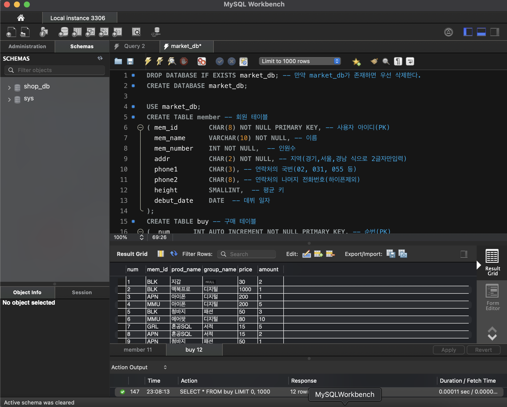
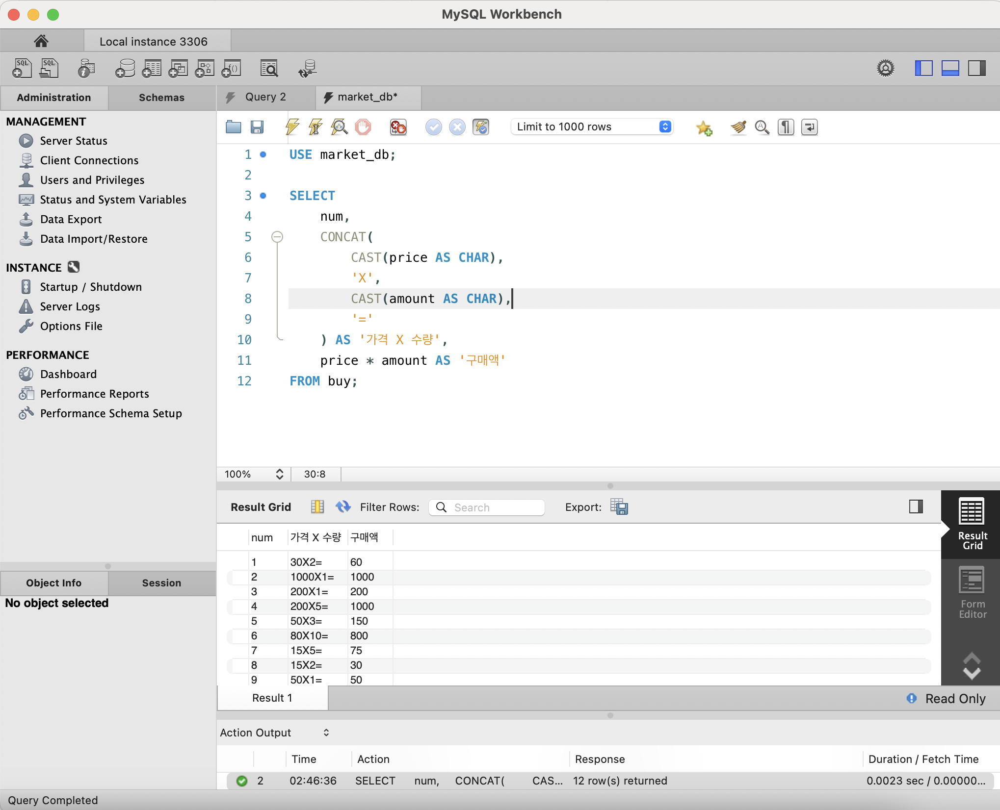
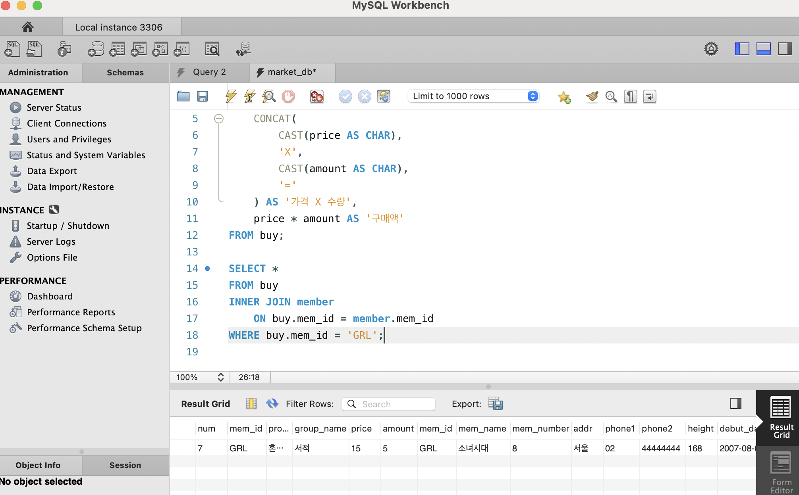
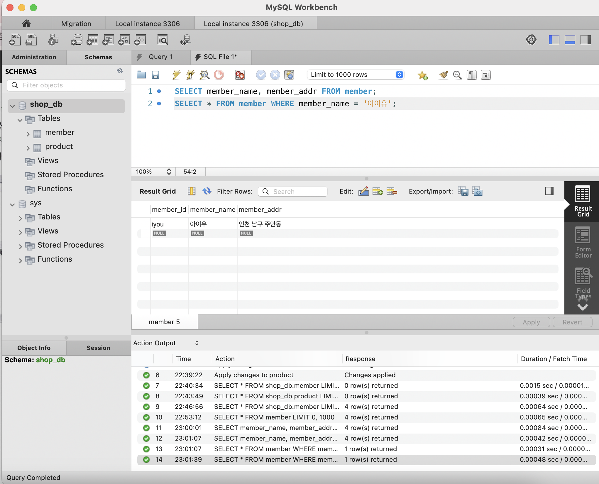
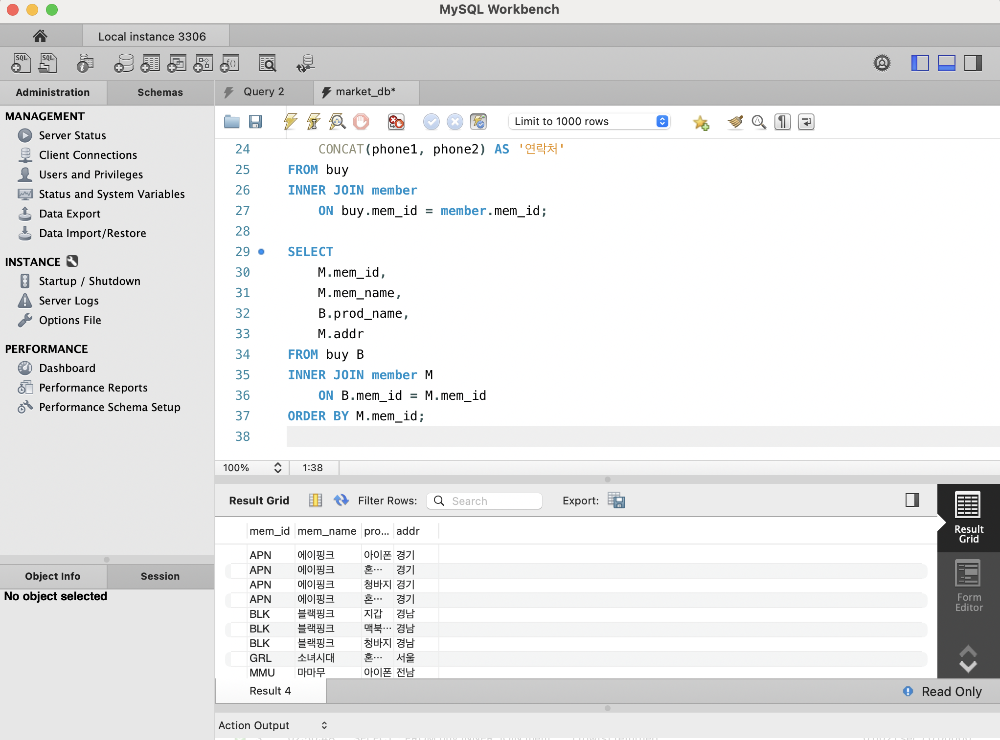
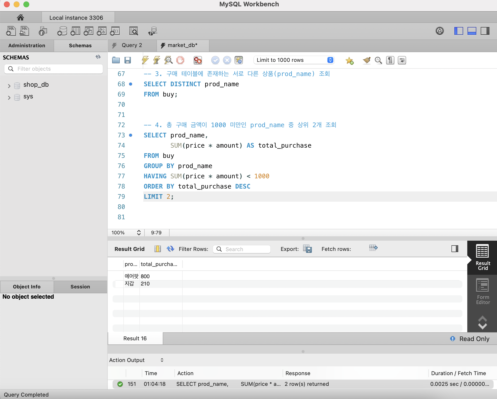

# SQL_ADVANCED 2주차 정규 과제 

📌SQL_ADVANCED 정규과제는 매주 정해진 분량의 『*혼자 공부하는 SQL*』 을 읽고 학습하는 것입니다. 이번주는 아래의 **SQL_ADVANCED_2nd_TIL**에 나열된 분량을 읽고 공부하시면 됩니다.

아래의 문제를 풀어보며 학습 내용을 점검하세요. 문제를 해결하는 과정에서 개념을 스스로 정리하고, 필요한 경우 제시된 강의를 참고하여 보완하는 것이 좋습니다.

<!-- 강의 링크는 아래와 같습니다.
https://www.youtube.com/watch?v=_JURyg_KzHE&list=PLVsNizTWUw7GCfy5RH27cQL5MeKYnl8Pm&index=7
https://www.youtube.com/watch?v=6qkPy7RfLqQ&list=PLVsNizTWUw7GCfy5RH27cQL5MeKYnl8Pm&index=8
https://www.youtube.com/watch?v=WWAFAm9op2U&list=PLVsNizTWUw7GCfy5RH27cQL5MeKYnl8Pm&index=9
-->

**교재 실습 예제 파일은 08_SQL_ADVANCED_Template 레포지토리의 src 폴더에 업로드되어 있습니다. market_db 파일도 해당 폴더에 함께 포함되어 있으니 참고하시기 바랍니다.**

**👀(수행 인증샷은 필수입니다.)** 

## SQL_ADVANCED_2nd_TIL

### 3장 SQL 기본 문법
#### 01. 기본 중에 기본 SELECT ~ FROM ~ WHERE
#### 02. 좀 더 깊게 알아보는 SELECT문
#### 03. 데이터 변경을 위한 SQL문


## Study Schedule

| 주차  | 공부 범위     | 완료 여부 |
| ----- | ------------- | --------- |
| 1주차 | p.24~99    | ✅         |
| 2주차 | p.102~155   | ✅         |
| 3주차 | p.158~213  | 🍽️         |
| 4주차 | p.216~271 | 🍽️         |
| 5주차 | p.274~327 | 🍽️         |
| 6주차 | p.330~369 | 🍽️         |
| 7주차 | p.372~407 | 🍽️         |


<br>

<!-- 여기까진 그대로 둬 주세요-->

---

# 1️⃣ 학습 내용 정리

## 0. 1week SQL 및 기본개념 내용 정리 (지난주차 개념학습한 내용입니다.)
# 📚 01. 데이터베이스 기초

## 01-1. 데이터베이스 알아보기

### 🗂️ 데이터베이스(Database, DB)

> **데이터베이스 = 데이터의 집합**

여러 데이터를 체계적으로 모아 저장해 놓은 **저장소**를 의미함.

* 여러 명의 사용자 또는 응용 프로그램이 함께 사용할 수 있음.
* 여러 사용자가 **동시에 접근**할 수 있어야 함.
* 데이터의 저장뿐만 아니라 **검색·수정·삭제·관리**가 가능해야 함.

#### 💡 예시 : 은행 예금 계좌

은행에는 수많은 사람들의 예금 계좌 정보가 존재함.

예금 계좌 데이터베이스에는 다음과 같은 사람들이나 프로그램이 동시에 접근할 수 있음.

* 👤 예금 계좌 주인
* 🧑‍💼 은행 직원
* 💻 인터넷 뱅킹
* 🏧 ATM 기기
> **여러 사람의 예금 계좌 정보를 모아 놓은 것 = 데이터베이스**

---

## 🖥️ DBMS

### DBMS(Database Management System)

> **데이터베이스를 관리하고 운영하는 소프트웨어**

DBMS는 데이터를 저장하고 관리하며 사용자가 데이터베이스에 접근할 수 있도록 도와주는 프로그램임.

### 대표적인 DBMS

| DBMS           | 특징                     |
| -------------- | ---------------------- |
| **MySQL**      | 오픈소스 기반의 대표적인 관계형 DBMS |
| **Oracle**     | 기업 환경에서 많이 사용되는 DBMS   |
| **SQL Server** | Microsoft에서 개발한 DBMS   |
| **MariaDB**    | MySQL에서 파생된 오픈소스 DBMS  |
---
# 💬 SQL
### SQL(Structured Query Language)
> **사람과 DBMS가 소통하기 위한 언어**

대표적인 SQL 예약어.

```sql
SELECT
FROM
WHERE
INSERT
UPDATE
DELETE
```
---
# 🏗️ DBMS의 분류

DBMS는 데이터 구조를 어떤 방식으로 구성하는지에 따라 여러 유형으로 분류됨.
* 계층형 DBMS
* 망형 DBMS
* **관계형 DBMS**
* 객체지향형 DBMS
* 객체관계형 DBMS
현재 사용되는 DBMS 중에서는 **관계형 DBMS**가 가장 널리 사용됨.
> 우리가 사용하는 **MySQL 역시 관계형 DBMS(RDBMS)**에 해당함.
---
# 🔗 관계형 DBMS
### RDBMS(Relational Database Management System)

관계형 DBMS는 데이터를 **테이블(Table)** 형태로 관리함.

하나의 데이터베이스는 여러 개의 테이블로 구성될 수 있음.

테이블은 크게 두 가지 요소로 구성됨.

* **열(Column)** : 데이터의 종류 또는 속성
* **행(Row)** : 하나의 실제 데이터
---

# ⚙️ 01-2. MySQL 설치하기

MySQL을 사용할 때 주로 다음 두 프로그램을 사용함.

## 🖥️ MySQL Server 
> 데이터베이스 엔진을 실제로 운영하는 핵심 프로그램
데이터를 저장하고 SQL 명령을 처리하는 역할을 담당함.

---

## 🛠️ MySQL Workbench

> MySQL Server에 접속해서 데이터베이스를 편리하게 관리할 수 있도록 해주는 프로그램

SQL 문을 직접 작성하고 실행할 수 있음.
```text
사용자
  ↓
MySQL Workbench
  ↓
MySQL Server
  ↓
Database
```
---

## 👑 root

> MySQL에서 가장 높은 권한을 가진 관리자 계정

* MySQL 설치 시 기본적으로 생성됨.
* 데이터베이스 생성·삭제 및 사용자 관리 등 거의 모든 작업이 가능함.
---

# 🏢 02. 데이터베이스 설계

## 02-1. 건물을 짓기 위한 설계도 : 데이터베이스 모델링

### 🏗️ 데이터베이스 모델링(Database Modeling)

> 현실 세계의 사물이나 업무를 DBMS에서 사용할 수 있도록 **테이블 구조로 설계하는 과정**

```text
현실 세계
   ↓
데이터 분석
   ↓
테이블 구조 설계
   ↓
데이터베이스 구축
```
---

## 🌊 폭포수 모델(Waterfall Model)

데이터베이스 또는 시스템을 개발할 때 대표적으로 사용되는 개발 방식 중 하나. 각 단계를 순차적으로 진행하는 방식.
---
# 🔑 기본 키

### Primary Key(PK)

> **각 행(Row)을 구분할 수 있는 유일한 값**
* 네이버 회원 아이디
* 학번
* 주민등록번호
* 회원번호

### 기본 키의 조건

✅ 다른 행과 **중복되면 안 됨**

✅ 값이 **비어 있으면 안 됨(NULL 불가)**

✅ 각 행을 **유일하게 식별**할 수 있어야 함

> 📌 기본 키는 한 테이블에서 하나의 기본 키 제약조건만 지정함. 일반적으로 하나의 열을 기본 키로 사용하지만, 필요하면 여러 열을 묶은 **복합 기본 키(Composite Key)**도 사용할 수 있음.
---

# 🗃️ 02-2. 데이터베이스 시작부터 끝까지

## 📦 스키마(Schema)

MySQL에서는 일반적으로

> **스키마 ≒ 데이터베이스** 
로 생각하면 됨.
```sql
CREATE DATABASE shop_db;
```
에서 `shop_db`가 하나의 데이터베이스이자 스키마라고 볼 수 있음.
---
# ⚠️ 예약어(Reserved Word)

SQL에서 이미 특별한 의미로 사용하기로 약속된 단어.
```sql
SELECT
FROM
WHERE
ORDER BY
GROUP BY
INSERT
UPDATE
DELETE
```

```sql
SELECT name
FROM member
WHERE age >= 20;
```
* `SELECT` → 어떤 데이터를 가져올지
* `FROM` → 어느 테이블에서 가져올지
* `WHERE` → 어떤 조건의 데이터를 가져올지

를 의미함.

> 📌 예약어는 SQL 문법에서 이미 정해진 의미가 있기 때문에 테이블명이나 열 이름으로 사용할 때 주의해야 함.
---

# 🧩 02-3. 데이터베이스 개체

데이터베이스에는 테이블 외에도 여러 가지 **데이터베이스 개체(Database Object)**가 존재함.

대표적으로

* 인덱스(Index)
* 뷰(View)
* 스토어드 프로시저(Stored Procedure)

가 있음.

---

# 인덱스(Index)

> 책의 **'찾아보기'**와 비슷한 개념

데이터베이스에서 원하는 데이터를 빠르게 찾을 수 있도록 도와주는 기능임. 데이터가 매우 많은 테이블에서 검색 성능을 높이는 데 중요한 역할을 함.

---

# 뷰(View)

> **실제 테이블을 기반으로 만들어진 가상의 테이블**

실제 데이터를 별도로 저장하는 테이블과 달리, 기존 테이블의 데이터를 특정 조건이나 형태로 보여주는 역할을 함.
바로가기 아이콘, 원본 테이블을 직접 사용하지 않고 필요한 데이터만 볼 수 있음.

# 스토어드 프로시저(Stored Procedure)

> 여러 개의 SQL 문을 하나로 묶어서 저장하고 실행할 수 있는 MySQL의 프로그래밍 기능
반복적으로 사용하는 SQL 문들을 하나로 묶어 놓을 수 있음.


## 1. 기본 중에 기본 SELECT ~ FROM ~ WHERE

<!-- 기본적인 SQL 문법에 관해 배우게 된 점을 적어주세요. -->
## 📌 1. SELECT 문
`SELECT` 문은 **구축이 완료된 테이블에서 원하는 데이터를 조회하거나 추출**할 때 사용함.
### 기본 형식
```sql
SELECT 열이름
FROM 테이블이름
WHERE 조건식;
```
* `SELECT` 뒤: 조회할 **열 이름**
* `FROM` 뒤: 데이터를 가져올 **테이블 이름**
* `WHERE` 뒤: 조회할 데이터의 **조건식**
---

## 🗑️ 2. 데이터베이스 생성 및 삭제

### 데이터베이스 삭제
```sql
DROP DATABASE IF EXISTS market_db;
```
* `DROP DATABASE`: 데이터베이스 삭제
* `IF EXISTS`: 해당 데이터베이스가 존재할 경우에만 삭제
* `market_db`: 삭제할 데이터베이스 이름

### 데이터베이스 생성
```sql
CREATE DATABASE market_db;
```
`market_db`라는 새로운 데이터베이스를 생성함.
---
## 📂 3. 사용할 데이터베이스 선택
```sql
USE market_db;
```
`market_db` 데이터베이스를 현재 사용할 데이터베이스로 지정함.
MySQL Workbench의 **Schemas 패널에서 데이터베이스를 선택하는 것과 같은 역할**을 함.
---
## 👤 4. 회원 테이블 만들기
```sql
CREATE TABLE member
(
    mem_id      CHAR(8) NOT NULL PRIMARY KEY,
    mem_name    VARCHAR(10) NOT NULL,
    mem_number  INT NOT NULL,
    addr        CHAR(2) NOT NULL,
    phone1      CHAR(3),
    phone2      CHAR(8),
    height      SMALLINT,
    debut_date  DATE
);
```
### 주요 문법
```sql
CREATE TABLE member
```
`member`라는 이름의 테이블을 생성함.
```sql
NOT NULL
```
해당 열에 반드시 값이 입력되어야 함.
```sql
PRIMARY KEY
```
각 행을 구분하는 기본 키를 지정함.
---
## 💬 5. SQL 주석
SQL에서 하이픈 `-`을 두 개 연속으로 사용하면 이후 내용은 주석으로 처리됨.
---
## 🛒 6. 구매 테이블 만들기
```sql
CREATE TABLE buy
(
    num         INT AUTO_INCREMENT NOT NULL PRIMARY KEY,
    mem_id      CHAR(8) NOT NULL,
    prod_name   CHAR(6) NOT NULL,
    group_name  CHAR(4),
    price       INT NOT NULL,
    amount      SMALLINT NOT NULL,
    
    FOREIGN KEY (mem_id)
    REFERENCES member(mem_id)
);
```
---

## 🔢 7. AUTO_INCREMENT

```sql
num INT AUTO_INCREMENT
```
새로운 데이터가 입력될 때마다 숫자가 자동으로 증가함.
---
## ✏️ 9. 데이터 입력하기
데이터를 테이블에 추가할 때 `INSERT INTO`를 사용함.
### 회원 데이터 입력
```sql
INSERT INTO member
VALUES(
    'TWC',
    '트와이스',
    9,
    '서울',
    '02',
    '11111111',
    167,
    '2015-10-19'
);
```
### 자료형에 따른 입력 방법

문자형과 날짜형은 작은따옴표 `' '`를 사용함.
```sql
'TWC'
'트와이스'
'서울'
'2015-10-19'
```
숫자형은 작은따옴표 없이 입력함.
```sql
9
167
```
---
## 🔄 10. AUTO_INCREMENT 열에 데이터 입력
```sql
INSERT INTO buy
VALUES(NULL, 'BLK', '지갑', NULL, 30, 2);
```
`buy` 테이블의 첫 번째 열인 `num`은 `AUTO_INCREMENT`로 설정되어 있기 때문에 직접 번호를 입력하지 않아도 됨.
```sql
NULL
```
을 입력하면 MySQL이 자동으로 번호를 부여함.
---
## 🔍 11. 데이터 조회하기
### 전체 데이터 조회

```sql
SELECT * FROM member;
```

```sql
SELECT * FROM buy;
```

###  `*`
모든 열을 의미함.

```sql
SELECT * FROM member;
```
`member` 테이블의 모든 열과 모든 행을 조회함.

---
## 📊 12. SELECT ~ FROM

기본 조회 문법

```sql
SELECT 열이름
FROM 테이블이름;
```
---
## 🎯 13. SELECT ~ FROM ~ WHERE

특정 조건에 해당하는 데이터만 조회할 때 `WHERE`절을 사용함.

```sql
SELECT 열이름
FROM 테이블이름
WHERE 조건식;
```
---
## ⚖️ 14. 관계 연산자

`WHERE`절에서 숫자나 값의 크기를 비교할 때 사용함.

| 연산자          | 의미     |
| ------------ | ------ |
| `=`          | 같다     |
| `>`          | 크다     |
| `<`          | 작다     |
| `>=`         | 크거나 같다 |
| `<=`         | 작거나 같다 |
| `<>` 또는 `!=` | 같지 않다  |

---

## 🧩 15. 논리 연산자

조건이 여러 개일 때 사용함.

### AND

모든 조건을 만족해야 함.

### OR

조건 중 하나 이상을 만족하면 됨.
---

## 📍 16. IN

여러 값 중 하나에 해당하는 데이터를 조회할 때 사용함.

```sql
WHERE addr IN ('경기', '전남', '경남');
```

다음 조건을 간단하게 표현한 것과 같음.

```sql
WHERE addr = '경기'
   OR addr = '전남'
   OR addr = '경남';
```
---
## 🔎 17. LIKE

문자열의 일부를 조건으로 검색할 때 사용함.

```sql
WHERE mem_name LIKE '우%';
```
`우`로 시작하는 모든 문자열을 조회함.
### `%`

0개 이상의 모든 문자를 의미함.

###  `_`

정확히 **한 글자**를 의미함.

```sql
WHERE mem_name LIKE '에이_크';
```

`_` 위치에 한 글자가 들어가는 문자열을 검색함.

---
## 🧱 19. 서브쿼리(Subquery)

> SQL문 안에 또 다른 `SELECT`문을 작성하는 방식

예시:

```sql
SELECT mem_name, height
FROM member
WHERE height >
(
    SELECT height
    FROM member
    WHERE mem_name = '에이핑크'
);
```

### 실행 순서

먼저 내부 쿼리가 실행됨.

```sql
SELECT height
FROM member
WHERE mem_name = '에이핑크';
```

에이핑크의 키를 조회함.

그 후 바깥 쿼리가 실행됨.

```sql
SELECT mem_name, height
FROM member
WHERE height > 에이핑크의_키;
```
에이핑크보다 키가 큰 회원의 이름과 키를 조회함.
---
<!-- 과제 페이지를 참조하여 인증 사진 2장을 아래의 부분을 지우고 제출해주세요. -->




> **확인문제: 주소의 지역이 서울, 경기인 회원을 추출하는 SQL 문입니다. 빈칸에 들어갈 수 있는 것을 모두 고르세요.**

```sql
SELECT *
FROM table
WHERE ________;
```

보기는 아래와 같습니다.
```
1. addr IN('서울', '경기')
2. addr BETWEEN '서울' AND '경기'
3. addr = '서울' OR addr = '경기'
4. addr = '서울' AND addr = '경기'
```

```
정답: 1번, 3번
addr IN('서울', '경기') → 주소가 서울 또는 경기인 행을 조회
addr = '서울' OR addr = '경기' → 위와 같은 의미
반면에,
BETWEEN '서울' AND '경기'는 문자열 범위 비교라 의도와 맞지 않음
addr = '서울' AND addr = '경기'는 한 행의 addr 값이 동시에 서울이면서 경기일 수 없으므로 성립하지 않음
```

## 2. 좀 더 깊게 알아보는 SELECT문

<!-- ORDER BY절과 GROUP BY절 그리고 HAVING절에 관해 배우게 된 점을 적어주세요. -->

```
# 📌 ORDER BY절, GROUP BY절, HAVING절

## 🔢 ORDER BY절

`ORDER BY`절은 조회한 데이터를 **특정 열을 기준으로 정렬**할 때 사용함.

```sql
SELECT *
FROM member
ORDER BY height;
```

기본적으로 **오름차순(ASC)**으로 정렬되며, `DESC`를 사용하면 내림차순으로 정렬할 수 있음.

```sql
SELECT *
FROM member
ORDER BY height DESC;
```

* `ASC` : 오름차순으로 정렬함
* `DESC` : 내림차순으로 정렬함
* 여러 개의 열을 기준으로 정렬하는 것도 가능함

---
## 📊 GROUP BY절

`GROUP BY`절은 같은 값을 가진 데이터를 **하나의 그룹으로 묶어서 집계**할 때 사용함.

주로 `SUM()`, `AVG()`, `COUNT()`, `MAX()`, `MIN()`과 같은 **집계 함수**와 함께 사용함.

```sql
SELECT mem_id, SUM(amount)
FROM buy
GROUP BY mem_id;
```

위 SQL문은 회원별로 구매 수량을 묶어 합계를 구함.

* 같은 값을 가진 행을 하나의 그룹으로 묶음
* 그룹별 합계, 평균, 개수 등을 구할 수 있음
* 데이터를 요약하고 분석할 때 유용함

---

## 🎯 HAVING절

`HAVING`절은 `GROUP BY`로 그룹화한 결과에 **조건을 적용**할 때 사용함.

```sql
SELECT mem_id, SUM(price * amount)
FROM buy
GROUP BY mem_id
HAVING SUM(price * amount) > 1000;
```

위 SQL문은 회원별 구매금액을 계산한 뒤, 총 구매금액이 1000보다 큰 회원만 조회함.

`WHERE`절과 비슷하게 조건을 설정하지만, 적용되는 대상과 시점이 다름.

| 구분       | WHERE         | HAVING      |
| -------- | ------------- | ----------- |
| 조건 대상    | 개별 행          | 그룹화된 결과     |
| 실행 시점    | GROUP BY 이전   | GROUP BY 이후 |
| 집계 함수 조건 | 일반적으로 사용하지 않음 | 사용 가능함      |


> **확인문제: 다음 표는 주요 집계함수를 정리한 것입니다. 각 설명에 해당하는 올바른 함수명을 기호에 맞게 작성하세요.**

| 함수명 | 설명 |
|--------|------|
| SUM() | 합계를 구합니다. |
| (ㄱ) | 평균을 구합니다. |
| (ㄴ) | 최소값을 구합니다. |
| MAX() | 최대값을 구합니다. |
| (ㄷ) | 행의 개수를 셉니다. |
| (ㄹ) | 행의 개수를 셉니다 (중복은 1개만 인정). |

```
(ㄱ) AVG()
(ㄴ) MIN()
(ㄷ) COUNT()
(ㄹ) COUNT(DISTINCT 열이름)
```
## 3. 데이터 변경을 위한 SQL문

<!-- INSERT문, UPDATE문, DELETE문에 관해 배우게 된 점을 적어주세요. -->

```
# 📌 INSERT문, UPDATE문, DELETE문

## ➕ INSERT문

`INSERT`문은 테이블에 **새로운 데이터를 추가**할 때 사용함.

### 기본 형식

```sql
INSERT INTO 테이블이름
VALUES(값1, 값2, 값3, ...);
```

예시

```sql
INSERT INTO member
VALUES('TWC', '트와이스', 9, '서울');
```

* 테이블에 새로운 행(Row)을 추가함
* 입력하는 값의 순서는 테이블의 열 순서와 일치해야 함
* 문자형 데이터는 일반적으로 작은따옴표 `' '`로 묶어서 입력함
* 숫자형 데이터는 작은따옴표 없이 입력함

특정 열에만 값을 입력할 수도 있음.

```sql
INSERT INTO member(mem_id, mem_name, addr)
VALUES('ABC', '에이비씨', '서울');
```

이 경우 지정하지 않은 열에는 기본값이나 `NULL`이 입력될 수 있음.

---

## ✏️ UPDATE문

`UPDATE`문은 테이블에 이미 저장되어 있는 데이터를 **수정**할 때 사용함.

### 기본 형식

```sql
UPDATE 테이블이름
SET 열이름 = 변경할값
WHERE 조건식;
```

예시

```sql
UPDATE member
SET addr = '경기'
WHERE mem_id = 'TWC';
```

`mem_id`가 `TWC`인 회원의 주소를 `경기`로 변경함.

여러 개의 열을 동시에 수정할 수도 있음.

```sql
UPDATE member
SET addr = '서울',
    height = 170
WHERE mem_id = 'TWC';
```

* `SET`을 이용하여 변경할 열과 값을 지정함
* `WHERE`절을 이용하여 수정할 행을 지정함
* `WHERE`절을 생략하면 **테이블의 모든 행이 수정될 수 있으므로 주의해야 함**

---

## 🗑️ DELETE문

`DELETE`문은 테이블에 저장된 데이터를 **삭제**할 때 사용함.

### 기본 형식

```sql
DELETE FROM 테이블이름
WHERE 조건식;
```

예시

```sql
DELETE FROM member
WHERE mem_id = 'TWC';
```

`mem_id`가 `TWC`인 행을 삭제함.

* `WHERE`절을 이용하여 삭제할 데이터를 선택함
* `WHERE`절을 생략하면 테이블의 **모든 데이터가 삭제됨**
* 테이블 자체가 삭제되는 것은 아니며 데이터만 삭제됨

---

## ⚠️ UPDATE와 DELETE 사용 시 주의점

`UPDATE`문과 `DELETE`문은 `WHERE`절 사용 여부가 매우 중요함.

```sql
UPDATE member
SET addr = '서울';
```

위와 같이 `WHERE`절이 없으면 모든 회원의 주소가 `서울`로 변경됨.

```sql
DELETE FROM member;
```

위와 같이 `WHERE`절이 없으면 테이블에 저장된 모든 행이 삭제됨.

따라서 데이터를 수정하거나 삭제하기 전에는 `SELECT`문을 이용하여 조건에 해당하는 데이터를 먼저 확인하는 것이 좋음.

```sql
SELECT *
FROM member
WHERE mem_id = 'TWC';
```

---
# 2️⃣ 실습과제

다음 SQL 문을 작성하고 실행 결과를 확인 후 인증 사진을 아래에 업로드하세요.(market_db를 그대로 사용합니다.)

1. 모든 그룹 멤버의 정보를 조회하시오.
2. 멤버의 수가 6명 이상인 그룹 정보를 조회하시오.
3. 현재 구매 테이블에 존재하는 서로 다른 상품(prod_name)이 어떤 것이 있는지 조회하시오.
4. 총 구매 금액이 1000미만인 prod_name 중 상위 2개만 조회하시오.






### 🎉 수고하셨습니다.


