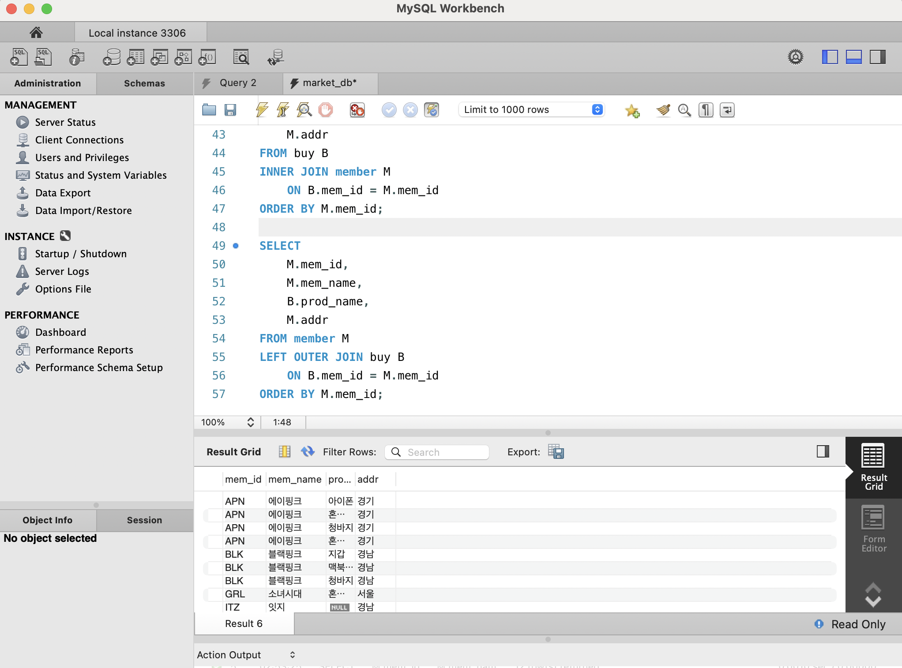
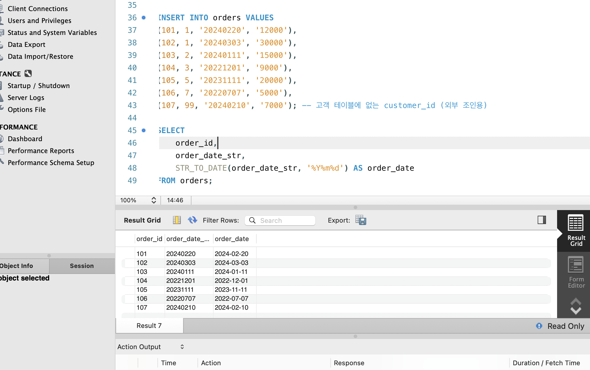
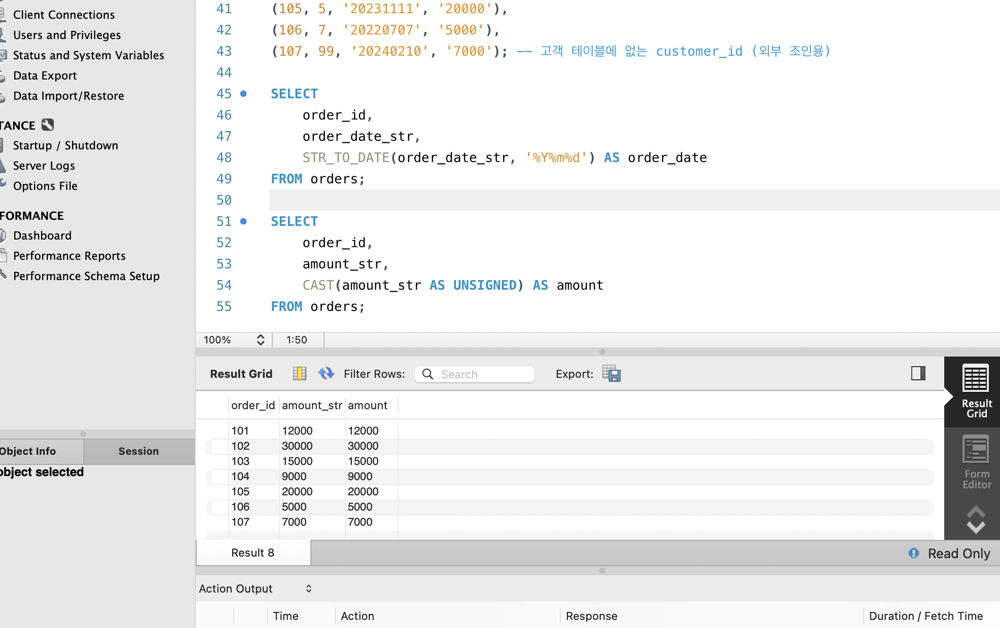
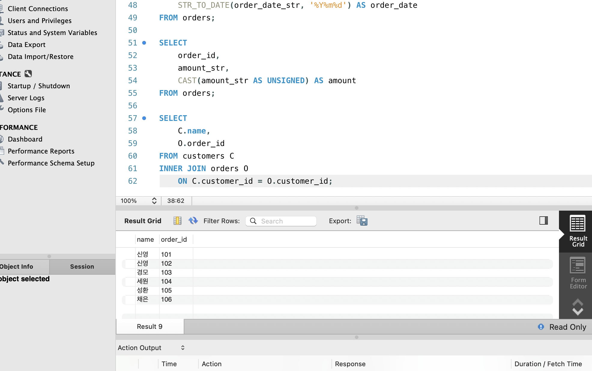
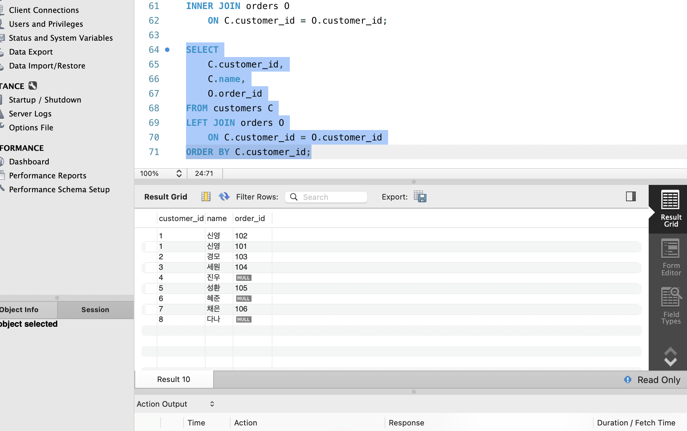
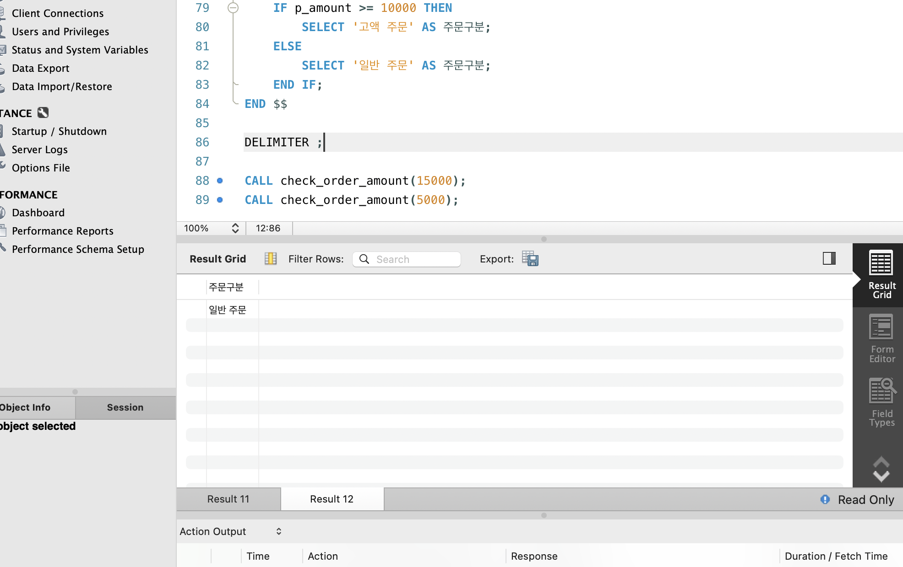

# SQL_ADVANCED 3주차 정규 과제 

📌SQL_ADVANCED 정규과제는 매주 정해진 분량의 『*혼자 공부하는 SQL*』 을 읽고 학습하는 것입니다. 이번주는 아래의 **SQL_ADVANCED_3rd_TIL**에 나열된 분량을 읽고 공부하시면 됩니다.

아래의 문제를 풀어보며 학습 내용을 점검하세요. 문제를 해결하는 과정에서 개념을 스스로 정리하고, 필요한 경우 제시된 강의를 참고하여 보완하는 것이 좋습니다.

<!-- 강의 링크는 아래와 같습니다.
https://www.youtube.com/watch?v=1YmWy-7-OhQ&list=PLVsNizTWUw7GCfy5RH27cQL5MeKYnl8Pm&index=10
https://www.youtube.com/watch?v=tuQFkzjqEGw&list=PLVsNizTWUw7GCfy5RH27cQL5MeKYnl8Pm&index=11
https://www.youtube.com/watch?v=IOCsreDYqFE&list=PLVsNizTWUw7GCfy5RH27cQL5MeKYnl8Pm&index=12
-->

**교재 실습 예제 파일은 08_SQL_ADVANCED_Template 레포지토리의 src 폴더에 업로드되어 있습니다. market_db 파일도 해당 폴더에 함께 포함되어 있으니 참고하시기 바랍니다.**

**👀(수행 인증샷은 필수입니다.)** 

## SQL_ADVANCED_3rd_TIL

### 4장 SQL 고급 문법
#### 01. MySQL의 데이터 형식
#### 02. 두 테이블을 묶는 조인
#### 03. SQL 프로그래밍 


## Study Schedule

| 주차  | 공부 범위     | 완료 여부 |
| ----- | ------------- | --------- |
| 1주차 | p.24~99    | ✅         |
| 2주차 | p.102~155   | ✅         |
| 3주차 | p.158~213  | ✅         |
| 4주차 | p.216~271 | 🍽️         |
| 5주차 | p.274~327 | 🍽️         |
| 6주차 | p.330~369 | 🍽️         |
| 7주차 | p.372~407 | 🍽️         |


<br>

<!-- 여기까진 그대로 둬 주세요-->

---

# 1️⃣ 학습 내용 정리

## 1. MySQL의 데이터 형식

<!-- MySQL의 데이터 형식에 관해 배우게 된 점을 적어주세요. -->
# 📚 MySQL 데이터 형식 정리
> 테이블을 만들 때 각 열(Column)에 어떤 종류의 데이터를 저장할 것인지 데이터 형식(Data Type)을 지정해야 함.  
> 데이터 형식에는 크게 정수형, 문자형, 실수형, 날짜형 등이 있음.
---
# 🔢 정수형
- 소수점이 없는 숫자를 저장할 때 사용함.
- 인원수, 수량, 나이, 순위 등 정수 형태의 데이터에 많이 사용함.
- 저장할 수 있는 숫자의 크기에 따라 데이터 형식이 나뉨.

| 데이터 형식 | 크기 | 저장 범위 |
|---|---:|---:|
| `TINYINT` | 1 Byte | -128 ~ 127 |
| `SMALLINT` | 2 Byte | -32,768 ~ 32,767 |
| `INT` | 4 Byte | 약 -21억 ~ +21억 |
| `BIGINT` | 8 Byte | 매우 큰 정수 저장 가능 |

```sql
mem_number INT
height SMALLINT
```

- `mem_number` → 그룹 인원수를 저장하므로 정수형 사용함.
- `height` → 키처럼 값의 범위가 크지 않은 경우 `SMALLINT` 사용 가능함.
- 뒤로 갈수록 저장할 수 있는 숫자의 범위와 필요한 저장 공간이 커짐.

> `TINYINT → SMALLINT → INT → BIGINT`

---

# 🔤 문자형

- 글자나 문자열을 저장할 때 사용함.
- 문자형을 사용할 때는 저장할 최대 글자 수를 지정함.
- 대표적인 데이터 형식으로 `CHAR`, `VARCHAR`가 있음.
```sql
CHAR(개수)
VARCHAR(개수)
```
## CHAR
- 고정 길이 문자형임.
- 저장되는 데이터의 길이가 일정할 때 주로 사용함.
- 데이터 길이가 일정한 경우 `CHAR` 사용이 적합함.

## VARCHAR
- 가변 길이 문자형임.
- 데이터마다 글자 수가 다를 때 주로 사용함.

## CHAR와 VARCHAR 비교

| 구분 | `CHAR` | `VARCHAR` |
|---|---|---|
| 길이 | 고정 길이 | 가변 길이 |
| 특징 | 길이가 일정한 데이터에 적합함 | 길이가 다양한 데이터에 적합함 |
| 예시 | 지역코드, 성별코드 등 | 이름, 주소, 상품명 등 |

- 길이가 일정하면 `CHAR` 사용함.
- 길이가 제각각이면 `VARCHAR` 사용함.
---

# 📊 실수형

- 소수점이 있는 숫자를 저장할 때 사용함.
- 평균, 비율, 측정값 등 소수점이 필요한 데이터에 사용함.
- 대표적으로 `FLOAT`, `DOUBLE`이 있음.

| 데이터 형식 | 크기 | 특징 |
|---|---:|---|
| `FLOAT` | 4 Byte | 비교적 낮은 정밀도의 실수 저장 |
| `DOUBLE` | 8 Byte | `FLOAT`보다 높은 정밀도의 실수 저장 |

- `DOUBLE`이 `FLOAT`보다 더 많은 자릿수를 정밀하게 표현할 수 있음.
- `FLOAT`, `DOUBLE`은 정확한 값보다는 근삿값을 저장하는 실수형임.
---
# 📅 날짜형
- 날짜 및 시간을 저장할 때 사용함.
- 날짜를 문자형으로 저장하는 것보다 날짜형으로 저장하면 날짜 계산, 정렬, 검색 등이 편리함.

| 데이터 형식 | 저장 내용 | 기본 형태 |
|---|---|---|
| `DATE` | 날짜 | `YYYY-MM-DD` |
| `TIME` | 시간 | `HH:MM:SS` |
| `DATETIME` | 날짜 + 시간 | `YYYY-MM-DD HH:MM:SS` |
## DATE
- 날짜만 저장함.
## TIME
- 시간만 저장함.
## DATETIME
- 날짜와 시간을 함께 저장함.
---
# 📦 변수의 사용
- 변수는 데이터를 임시로 저장해 두는 공간임.
- 같은 값을 반복해서 사용하거나 계산 결과를 잠시 저장할 때 유용함.
- MySQL에서 사용자 변수 앞에는 `@`를 붙임.

## 변수 선언 및 값 저장
```sql
SET @변수이름 = 값;
```
예시
```sql
SET @myVar = 5;
```
- `myVar`라는 변수에 숫자 `5`를 저장함.

변수의 값을 확인할 때는 `SELECT` 사용함.

```sql
SELECT @myVar;
```

결과

```text
5
```

## 문자열 저장

```sql
SET @name = '블랙핑크';

SELECT @name;
```

결과

```text
블랙핑크
```

## 계산에 활용

```sql
SET @price = 1000;
SET @count = 3;
SELECT @price * @count;
```
결과
```text
3000
```
- `SET` → 변수에 값을 저장함.
- `@변수명` → MySQL 사용자 변수를 의미함.
- `SELECT` → 변수의 값이나 계산 결과를 확인함.
---
# 🔄 데이터 형 변환

- 데이터의 현재 형식을 다른 데이터 형식으로 변경하는 것을 의미함.
- 문자형을 숫자형으로 바꾸거나 숫자형을 문자형으로 바꾸는 경우 등에 사용함.
---
## 명시적 형 변환
- 사용자가 직접 원하는 데이터 형식으로 변환하는 방식임.
- MySQL에서는 주로 `CAST()`, `CONVERT()` 함수를 사용함.
- 어떤 자료형으로 바뀌는지 코드에서 직접 확인할 수 있다는 장점이 있음.
### CAST()
기본 형태
```sql
CAST(값 AS 데이터형식)
```
### CONVERT()
기본 형태
```sql
CONVERT(값, 데이터형식)
```
- `CAST()`와 `CONVERT()` 모두 사용자가 직접 변환할 데이터 형식을 지정함.
---
## 암시적 형 변환
- 사용자가 별도의 변환 함수를 사용하지 않아도 MySQL이 자동으로 데이터 형식을 변환하는 방식임.
예시
```sql
SELECT '100' + 200;
```
- `'100'`은 문자형이지만 숫자 `200`과 계산하기 위해 MySQL이 자동으로 숫자형으로 변환함.
- 별도의 `CAST()`, `CONVERT()`를 사용하지 않았으므로 암시적 형 변환임.
- 편리하지만 예상하지 못한 형 변환이 일어날 수 있으므로 주의해야 함.
---
<!-- 과제 설명 예시처럼 직접 실습 후 사진 한 장 이상을 첨부해주세요. -->


> **확인문제: 다음 보기에서 데이터 형식의 변환에 사용되는 함수를 2개 고르세요.**

보기는 아래와 같습니다.
```
CONVERT() / DATA() / CAST() / MOVE() / TYPE() / SUM() / AVG() / CURRENT_DATE()
```

```
- `CONVERT()` : 데이터를 다른 데이터 형식으로 변환할 때 사용함.
- `CAST()` : 데이터를 지정한 데이터 형식으로 변환할 때 사용함.
```

## 2. 두 테이블을 묶는 조인

<!-- 두 테이블을 묶는 조인에 관해 배우게 된 점을 적어주세요. -->
# 🔗 조인(JOIN)
- 관계형 데이터베이스에서는 여러 개의 테이블을 서로 연결하여 필요한 데이터를 조회할 수 있음.
- 서로 관련된 테이블을 연결할 때 주로 `JOIN`을 사용함.
- 테이블 간 연결은 일반적으로 **기본 키(PK)와 외래 키(FK)**를 이용함.
---
# 일대다 관계
- **일대다 관계(1:N)**는 한쪽 테이블의 하나의 값이 다른 쪽 테이블의 여러 값과 연결되는 관계임.
- 관계형 데이터베이스에서 가장 흔하게 나타나는 관계임.
### 예시
`member` 테이블
| mem_id | mem_name |
|---|---|
| APN | 에이핑크 |
| BLK | 블랙핑크 |
`buy` 테이블
| num | mem_id | prod_name |
|---:|---|---|
| 1 | APN | 아이폰 |
| 2 | APN | 청바지 |
| 3 | APN | 책 |
| 4 | BLK | 지갑 |
- `member`에서 APN 회원은 한 명 존재함.
- `buy`에서는 APN의 구매 기록이 여러 개 존재할 수 있음.
- 따라서 `member : buy = 1 : N` 관계가 됨.
```text
member                buy
APN 에이핑크     →     APN 아이폰
                  →     APN 청바지
                  →     APN 책
```
> 한 명의 회원이 여러 번 구매할 수 있으므로 `member`와 `buy`는 일대다 관계임.
---

# 🔗 조인(JOIN)

- **조인(JOIN)**은 두 개 이상의 테이블을 서로 연결하여 하나의 결과로 조회하는 기능임.
- 각각의 테이블에 흩어져 있는 데이터를 함께 조회하고 싶을 때 사용함.
---
# 기본 키와 외래 키 관계
- 테이블을 서로 연결할 때 주로 **기본 키(PK)와 외래 키(FK)**를 이용함.
```text
member.mem_id  ↔  buy.mem_id
      PK              FK
```
- `member.mem_id` → 회원을 구분하는 기본 키임.
- `buy.mem_id` → 어떤 회원이 구매했는지 나타내는 외래 키 역할을 함.
- 두 컬럼의 값이 같다는 조건을 이용하여 테이블을 연결함.
---
# 내부 조인(INNER JOIN)
- 두 테이블에서 **조인 조건을 만족하는 데이터만 조회**함.
- 즉, 양쪽 테이블에 모두 존재하는 데이터만 결과에 포함됨.
### 기본 구조
```sql
SELECT 열이름
FROM 테이블1
INNER JOIN 테이블2
    ON 조인조건;
```
> `INNER JOIN` = 양쪽 테이블에 모두 존재하는 데이터만 조회함.
---
# 외부 조인(OUTER JOIN)
- 두 테이블을 조인할 때 **한쪽 테이블의 데이터는 조건에 맞는 데이터가 없어도 모두 출력**하는 방식임.
- 대표적으로 `LEFT OUTER JOIN`, `RIGHT OUTER JOIN`이 있음.
---
## LEFT OUTER JOIN
- **왼쪽 테이블의 모든 데이터를 출력**함.
- 오른쪽 테이블에 연결되는 데이터가 없어도 왼쪽 데이터는 결과에 남음.
- 연결되는 데이터가 없으면 오른쪽 테이블의 값이 `NULL`로 표시됨.
### 기본 구조
```sql
SELECT 열이름
FROM 테이블1
LEFT OUTER JOIN 테이블2
    ON 조인조건;
```
> `LEFT OUTER JOIN` = 왼쪽 테이블의 데이터는 무조건 모두 살림.
---
## RIGHT OUTER JOIN
- **오른쪽 테이블의 모든 데이터를 출력**함.
- 왼쪽 테이블에 일치하는 데이터가 없어도 오른쪽 데이터는 결과에 포함됨.
### 기본 구조
```sql
SELECT 열이름
FROM 테이블1
RIGHT OUTER JOIN 테이블2
    ON 조인조건;
```
### 핵심
> `RIGHT OUTER JOIN` = 오른쪽 테이블의 데이터는 무조건 모두 살림.
---
# 상호 조인(CROSS JOIN)
- 한쪽 테이블의 **모든 행과 다른 테이블의 모든 행을 각각 조합**하는 조인임.
- 두 테이블의 모든 가능한 조합을 만들어 냄.
- 조인 조건인 `ON`을 사용하지 않는 경우가 일반적임.
### 기본 구조
```sql
SELECT *
FROM table1
CROSS JOIN table2;
```
> `CROSS JOIN` = 모든 경우의 수를 조합함.
---
# 자체 조인(SELF JOIN)
- **하나의 테이블을 자기 자신과 조인**하는 방식임.
- 실제 테이블은 하나지만 서로 다른 테이블처럼 사용하기 위해 별칭을 다르게 지정함.
### 기본 구조
```sql
SELECT *
FROM employee A
INNER JOIN employee B
    ON A.manager_id = B.employee_id;
```
- `employee`라는 같은 테이블을 `A`, `B`라는 서로 다른 이름으로 취급함.
- 직원과 상사처럼 하나의 테이블 내부에서 서로 관계가 있는 데이터를 조회할 때 사용함.
> `SELF JOIN` = 자기 자신과 조인함.  
---
# 헷갈려서 다시 정리
| 용어 | 의미 |
|---|---|
| 관계(Relationship) | 두 테이블이 서로 연관되어 있는 것 |
| 일대다 관계(1:N) | 한쪽 하나의 데이터가 다른 쪽 여러 데이터와 연결되는 관계 |
| 기본 키(PK) | 테이블에서 각 행을 고유하게 구분하는 값 |
| 외래 키(FK) | 다른 테이블의 기본 키를 참조하는 값 |
| 조인(JOIN) | 여러 테이블을 연결하여 하나의 결과로 조회하는 기능 |
| 별칭(Alias) | 테이블이나 컬럼 이름을 짧게 표현하는 이름 |
| `DISTINCT` | 중복되는 조회 결과를 제거함 |
| `LEFT OUTER JOIN` | 왼쪽 테이블의 모든 행을 출력함 |
| `RIGHT OUTER JOIN` | 오른쪽 테이블의 모든 행을 출력함 |
| `FULL OUTER JOIN` | 양쪽 테이블의 모든 행을 출력함 |
| `CREATE TABLE ~ SELECT` | `SELECT` 결과로 새로운 테이블을 생성함 |
---
<!-- 과제 설명 예시처럼 직접 실습 후 인증 사진 4장 이상을 첨부해주세요. -->




> **확인문제: 다음 SQL은 회원으로 가입만 하고, 한 번도 구매한 적이 없는 회원의 목록을 조회하는 쿼리입니다. 빈칸에 들어갈 가장 적절한 구문을 고르세요..**

```sql
SELECT DISTINCT M.mem_id, B.prod_name, M.mem_name, M.addr
  FROM member M
    LEFT OUTER JOIN buy B
    ON M.mem_id = B.mem_id
  __________
  ORDER BY M.mem_id;
```
보기는 아래와 같습니다.
```
1. JOIN B.prod_name IS NULL
2. LIMIT B.prod_name IS NULL
3. HAVING B.prod_name IS NULL
4. WHERE B.prod_name IS NULL
```
```
** 정답: 4. `WHERE B.prod_name IS NULL`**
member 테이블에는 전체 회원 정보가 들어 있음.
buy 테이블에는 실제로 상품을 구매한 회원의 정보만 들어 있음.
LEFT OUTER JOIN을 사용하면 왼쪽 테이블인 member의 회원은 모두 조회됨.
이때 구매 기록이 없는 회원은 buy 테이블과 연결되는 행이 없기 때문에 B.prod_name 값이 NULL로 표시됨.
따라서 WHERE B.prod_name IS NULL 조건을 사용하면 구매한 적이 없는 회원만 조회할 수 있음. 
```

## 3. SQL 프로그래밍 

<!-- IF문, CASE문, WHILE문에 관해 배우게 된 점을 적어주세요. -->

- **IF문**
  - 조건이 참인지 거짓인지에 따라 서로 다른 SQL문을 실행할 때 사용함.
  - 비교적 단순한 조건 분기에 적합함.
  - `IF ~ THEN ~ ELSE ~ END IF` 형태로 사용함.

- **CASE문**
  - 여러 조건을 순서대로 비교하여 조건에 맞는 결과를 처리할 때 사용함.
  - 조건이 여러 개인 경우 `IF문`보다 가독성이 좋아질 수 있음.
  - `CASE ~ WHEN ~ THEN ~ ELSE ~ END CASE` 형태로 사용할 수 있음.

- **WHILE문**
  - 특정 조건이 참인 동안 SQL문을 반복해서 실행할 때 사용함.
  - 반복 횟수를 직접 제어하거나 같은 작업을 여러 번 수행할 때 유용함.
  - 조건이 계속 참이면 무한 반복될 수 있으므로 종료 조건을 잘 설정해야 함.

> **확인문제: 다음은 CASE 문의 형식입니다. 빈칸에 들어갈 가장 적절한 명령어를 보기에서 고르세요..**

```sql
CASE
    (1) 조건 THEN
        SQL문장들1
    ELSE
        SQL문장들4
END (2);
```

보기는 아래와 같습니다.
```
WHEN / THEN / CURRENT / DATE / TIME / IF / END IF / CASE
```

```
여기에 답을 적어주세요!
(1) `WHEN`
(2) `CASE`
```


---

# 2️⃣ 실습과제

## 1. 데이터베이스 구축

아래 코드를 MySQL Workbench에 붙여넣은 후,  
**전체 드래그 → 실행 (Ctrl + shift + Enter)** 하여 데이터베이스를 구축하세요.

```sql
-- 1. 데이터베이스 생성
CREATE DATABASE IF NOT EXISTS week3_db;

-- 2. 사용할 데이터베이스 선택
USE week3_db;

-- 3. 기존 테이블 삭제 (초기화용)
DROP TABLE IF EXISTS orders;
DROP TABLE IF EXISTS customers;

-- 4. 테이블 생성 (조인 실습용)
CREATE TABLE customers (
    customer_id INT PRIMARY KEY,
    name VARCHAR(20),
    signup_date_str VARCHAR(8) 
);

CREATE TABLE orders (
    order_id INT PRIMARY KEY,
    customer_id INT,           
    order_date_str VARCHAR(8), 
    amount_str VARCHAR(10)     
);

-- 5. 데이터 삽입
INSERT INTO customers VALUES
(1, '신영', '20241528'),
(2, '경모', '20220261'),
(3, '세원', '20203401'),
(4, '진우', '20221024'),
(5, '성환', '20225100'),
(6, '혜준', '20244946'),
(7, '채은', '20250412'),
(8, '다나', '20212774'); -- 주문 없는 고객(외부 조인용)

INSERT INTO orders VALUES
(101, 1, '20240220', '12000'),
(102, 1, '20240303', '30000'),
(103, 2, '20240111', '15000'),
(104, 3, '20221201', '9000'),
(105, 5, '20231111', '20000'),
(106, 7, '20220707', '5000'),
(107, 99, '20240210', '7000'); -- 고객 테이블에 없는 customer_id (외부 조인용)
```

## 2. 실습 문제

다음 SQL 문을 작성하고 실행 결과를 확인 후 인증 사진을 아래에 업로드하세요.

1. **데이터 형식 변환**
   - orders 테이블의 `order_date_str`을 DATE 형식으로 변환하여 조회하시오.
   (힌트: STR_TO_DATE 사용)

2. **데이터 형식 변환**
   - orders 테이블의 `amount_str`을 숫자형으로 변환하여 조회하시오.

3. **내부 조인 (INNER JOIN)**
   - customers와 orders를 customer_id 기준으로 내부 조인하여
     고객 이름(name)과 주문 번호(order_id)를 함께 조회하시오.

4. **외부 조인 (LEFT JOIN)**
   - customers를 기준으로 LEFT JOIN을 수행하여,
     주문이 없는 고객도 함께 조회하시오.

5. **스토어드 프로시저 (IF문 사용)**
   - 입력받은 금액이 10000 이상이면 '고액 주문',
     그렇지 않으면 '일반 주문'을 출력하는
     프로시저를 생성하시오.
   - 생성 후 CALL로 실행 결과를 확인하시오.







### 🎉 수고하셨습니다.


