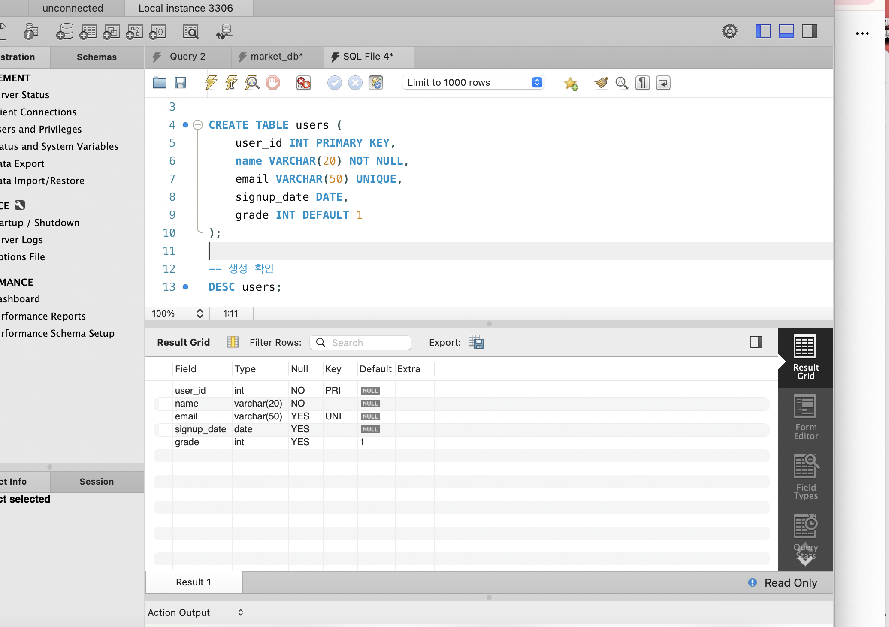
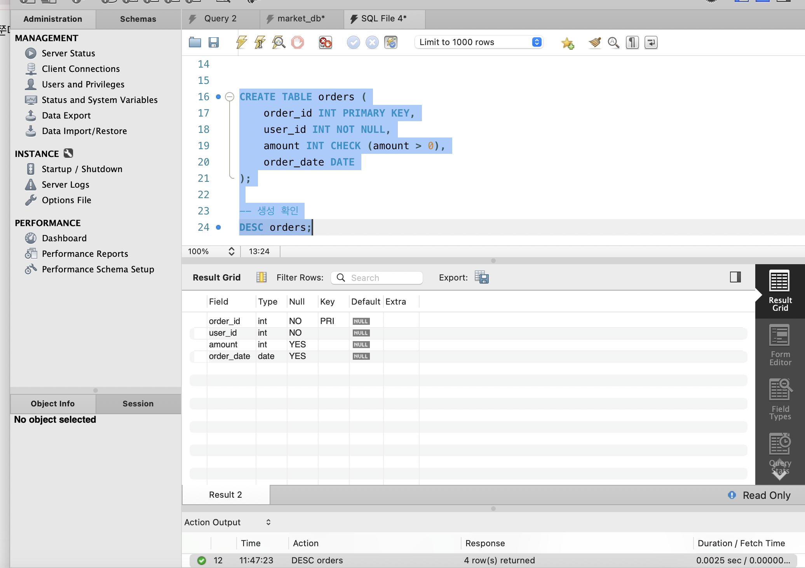
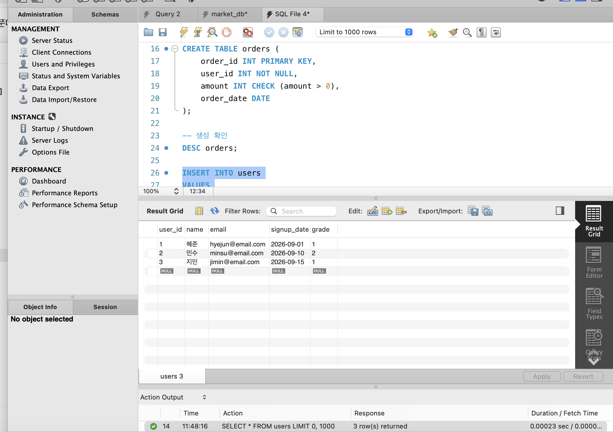
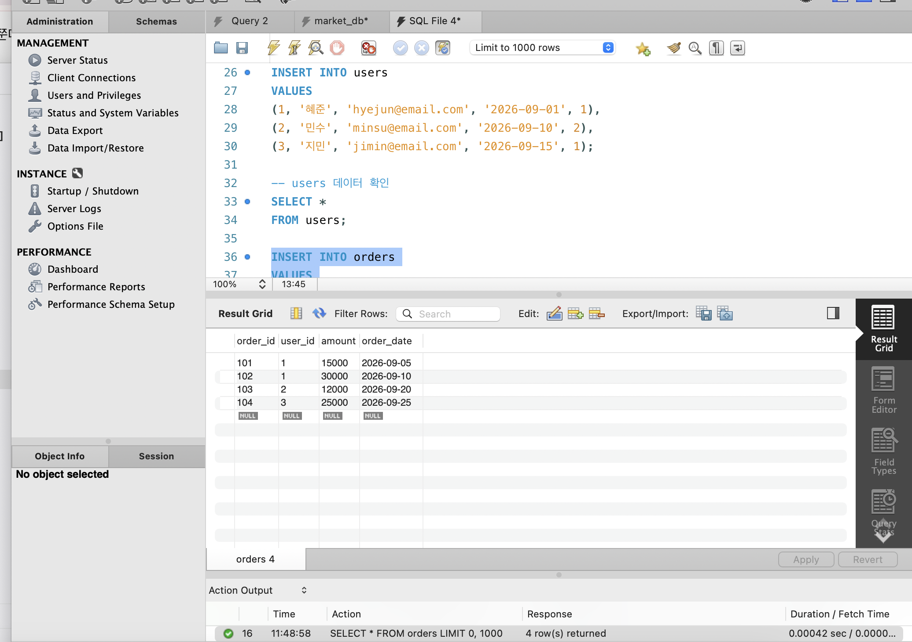
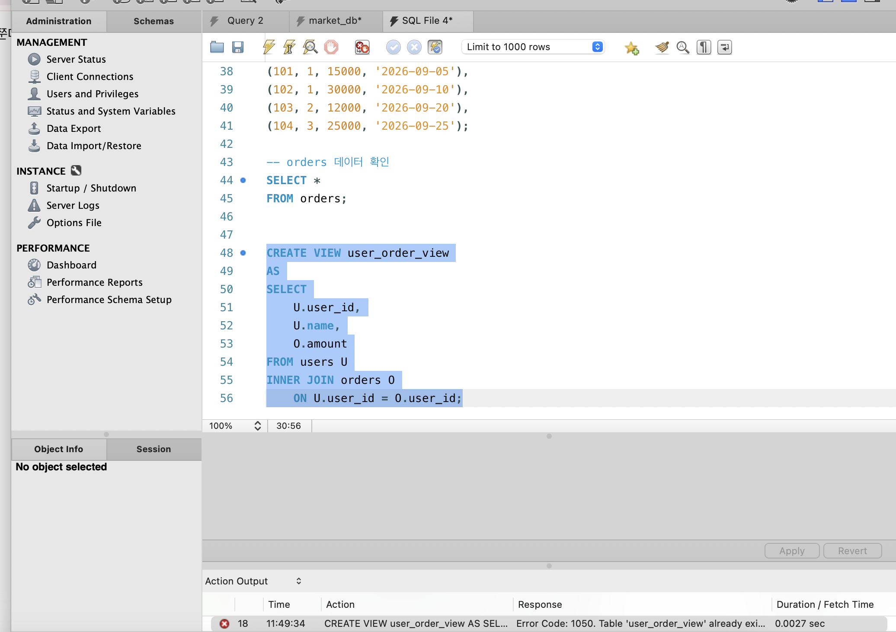
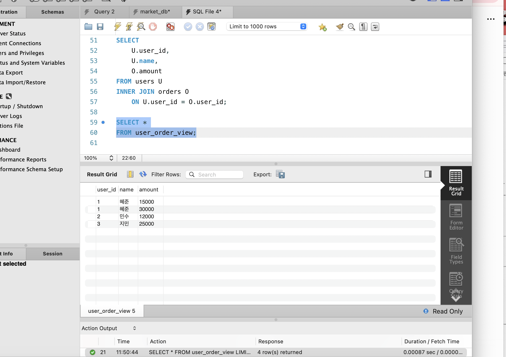

# SQL_ADVANCED 4주차 정규 과제 

📌SQL_ADVANCED 정규과제는 매주 정해진 분량의 『*혼자 공부하는 SQL*』 을 읽고 학습하는 것입니다. 이번주는 아래의 **SQL_ADVANCED_4th_TIL**에 나열된 분량을 읽고 공부하시면 됩니다.

아래의 문제를 풀어보며 학습 내용을 점검하세요. 문제를 해결하는 과정에서 개념을 스스로 정리하고, 필요한 경우 제시된 강의를 참고하여 보완하는 것이 좋습니다.

<!-- 강의 링크는 아래와 같습니다.
https://www.youtube.com/watch?v=DMNpkj_bZIs&list=PLVsNizTWUw7GCfy5RH27cQL5MeKYnl8Pm&index=13
https://www.youtube.com/watch?v=BUHj-behLyc&list=PLVsNizTWUw7GCfy5RH27cQL5MeKYnl8Pm&index=14
https://www.youtube.com/watch?v=JrXWxku7ZIM&list=PLVsNizTWUw7GCfy5RH27cQL5MeKYnl8Pm&index=15
-->

**교재 실습 예제 파일은 08_SQL_ADVANCED_Template 레포지토리의 src 폴더에 업로드되어 있습니다. market_db 파일도 해당 폴더에 함께 포함되어 있으니 참고하시기 바랍니다.**

**👀(수행 인증샷은 필수입니다.)** 

## SQL_ADVANCED_4th_TIL

### 5장 테이블과 뷰
#### 01. 테이블 만들기
#### 02. 제약조건으로 테이블을 견고하게
#### 03. SQL 가상의 테이블: 뷰 


## Study Schedule

| 주차  | 공부 범위     | 완료 여부 |
| ----- | ------------- | --------- |
| 1주차 | p.24~99    | ✅         |
| 2주차 | p.102~155   | ✅         |
| 3주차 | p.158~213  | ✅         |
| 4주차 | p.216~271 | ✅         |
| 5주차 | p.274~327 | 🍽️         |
| 6주차 | p.330~369 | 🍽️         |
| 7주차 | p.372~407 | 🍽️         |


<br>

<!-- 여기까진 그대로 둬 주세요-->

---

# 1️⃣ 학습 내용 정리

## 1. 테이블 만들기 

<!-- 테이블 만들기에 관해 배우게 된 점을 적어주세요. -->

- 테이블은 데이터를 저장하기 위한 기본 구조임.
- `CREATE TABLE` 문을 사용하여 새로운 테이블을 생성할 수 있음.
- 테이블을 만들 때는 각 열(Column)의 이름과 데이터 형식을 함께 지정해야 함.
- 데이터의 성격에 따라 `INT`, `VARCHAR`, `DATE` 등 적절한 데이터 형식을 선택해야 함.
- 이미 같은 이름의 테이블이 존재하는 경우 오류가 발생할 수 있으므로 `IF NOT EXISTS`를 사용할 수 있음.

### 기본 형식

```sql
CREATE TABLE 테이블명 (
    열이름 데이터형식,
    열이름 데이터형식
);
```

### 예시

```sql
CREATE TABLE member (
    mem_id CHAR(8),
    mem_name VARCHAR(10),
    mem_number INT,
    debut_date DATE
);
```

- `mem_id` → 회원 아이디를 문자형으로 저장함.
- `mem_name` → 회원 이름을 문자형으로 저장함.
- `mem_number` → 인원수를 정수형으로 저장함.
- `debut_date` → 날짜를 저장함.

### 테이블 삭제

```sql
DROP TABLE 테이블명;
```

- 기존 테이블을 삭제할 때 사용함.
- 테이블 구조와 저장된 데이터가 함께 삭제되므로 주의해야 함.

```sql
DROP TABLE IF EXISTS 테이블명;
```

- 해당 테이블이 존재할 경우에만 삭제함.
- 실습 시 기존 테이블을 초기화할 때 자주 사용함.

> 테이블을 만들 때는 어떤 데이터를 저장할 것인지 먼저 생각하고, 그에 맞는 열 이름과 데이터 형식을 지정하는 것이 중요함.

---

## 2. 제약조건으로 테이블을 견고하게 

<!-- 제약조건에 관해 배우게 된 점을 적어주세요. -->

- 제약조건(Constraint)은 잘못된 데이터가 테이블에 저장되는 것을 방지하기 위한 규칙임.
- 데이터의 정확성과 무결성을 유지하기 위해 사용함.
- 대표적인 제약조건으로 `PRIMARY KEY`, `FOREIGN KEY`, `NOT NULL`, `UNIQUE`, `CHECK`, `DEFAULT` 등이 있음.

### PRIMARY KEY

- 각 행을 고유하게 구분하기 위한 기본 키임.
- 같은 값이 중복될 수 없음.
- `NULL` 값도 허용되지 않음.
- 회원번호, 주문번호처럼 각각의 데이터를 정확하게 구별할 때 사용함.

```sql
mem_id CHAR(8) PRIMARY KEY
```

> `PRIMARY KEY` = 중복 불가 + NULL 불가

---

### FOREIGN KEY

- 다른 테이블의 기본 키를 참조하는 외래 키임.
- 서로 다른 테이블 사이의 관계를 설정할 때 사용함.
- 참조 대상 테이블에 존재하지 않는 값을 입력하는 것을 방지할 수 있음.

```sql
FOREIGN KEY (customer_id)
REFERENCES customers(customer_id)
```

예를 들어

```text
customers.customer_id
        ↓
orders.customer_id
```

와 같이 연결하면 주문 정보가 어떤 고객의 주문인지 관계를 설정할 수 있음.

---

### NOT NULL

- 해당 열에 반드시 값이 입력되도록 설정하는 제약조건임.
- 필수로 입력되어야 하는 데이터에 사용함.

```sql
mem_name VARCHAR(10) NOT NULL
```

- 회원 이름을 반드시 입력해야 함을 의미함.
- 값을 입력하지 않으면 오류가 발생함.

---

### UNIQUE

- 해당 열에 중복된 값을 입력하지 못하도록 설정함.
- 이메일, 전화번호처럼 같은 값이 반복되면 안 되는 데이터에 사용할 수 있음.

```sql
email VARCHAR(50) UNIQUE
```

- 동일한 이메일 주소가 중복 저장되는 것을 방지함.

### PRIMARY KEY와 UNIQUE 차이

| 구분 | `PRIMARY KEY` | `UNIQUE` |
|---|---|---|
| 중복 허용 | 불가 | 불가 |
| NULL 허용 | 불가 | 가능할 수 있음 |
| 주요 목적 | 행을 고유하게 식별함 | 값의 중복을 방지함 |

---

### CHECK

- 입력되는 값에 특정 조건을 설정할 때 사용함.
- 범위를 벗어난 잘못된 값이 입력되는 것을 방지할 수 있음.

```sql
age INT CHECK (age >= 0)
```

- 나이는 0 이상인 값만 입력할 수 있도록 설정함.

다른 예시

```sql
score INT CHECK (score >= 0 AND score <= 100)
```

- 점수를 0점에서 100점 사이로 제한함.

---

### DEFAULT

- 값을 따로 입력하지 않았을 때 자동으로 들어갈 기본값을 설정함.

```sql
grade VARCHAR(10) DEFAULT '일반'
```

- 사용자가 `grade` 값을 입력하지 않으면 자동으로 `'일반'`이 저장됨.

예시

```sql
status VARCHAR(10) DEFAULT '활성'
```

---

> **확인문제: 다음 보기 중에서 각 문항이 설명하는 것을 고르세요.**

보기는 아래와 같습니다.
```
CHECK / DEFAULT / PRIMAY KEY / UNIQUE / NOT NULL / FOREIGN KEY
```

```
여기에 답과 그 이유를 적어주세요!
1. 입력되는 데이터가 조건에 맞는지 검사하는 기능:`CHECK`
- `CHECK`는 입력되는 값이 지정한 조건을 만족하는지 검사하는 제약조건임.
- 조건을 만족하지 않으면 데이터 입력이 제한됨.
2. 값을 입력하지 않으면 자동으로 들어갈 값: 'DEFAULT'
- DEFAULT는 사용자가 값을 따로 입력하지 않았을 때 자동으로 들어갈 기본값을 지정함.
3. 빈 값을 입력하는 것을 허용하지 않음: ' NOT NULL ' 
- NOT NULL은 해당 열에 NULL 값이 들어가는 것을 허용하지 않는 제약조건임.
- 반드시 값이 입력되어야 하는 열에 사용함.
```


## 3. 가상의 테이블: 뷰 

<!-- 뷰에 관해 배우게 된 점을 적어주세요. -->


- **뷰(View)**는 실제 데이터를 직접 저장하지 않고, 기존 테이블의 조회 결과를 하나의 테이블처럼 사용하는 기능임.
- 즉, 실제 테이블이 아니라 **가상의 테이블**이라고 볼 수 있음.
- 복잡한 `SELECT`문을 미리 저장해두고 필요할 때 간단하게 조회할 수 있음.
- 뷰를 사용해도 실제 데이터는 원본 테이블에 저장되어 있음.

---

### 뷰 생성

- `CREATE VIEW`를 사용하여 새로운 뷰를 생성함.

```sql
CREATE VIEW 뷰이름
AS
SELECT 열이름
FROM 테이블명
WHERE 조건;
```

예시

```sql
CREATE VIEW member_view
AS
SELECT mem_id, mem_name, addr
FROM member;
```

- `member` 테이블에서 `mem_id`, `mem_name`, `addr`만 선택함.
- 해당 조회 결과를 `member_view`라는 이름의 뷰로 생성함.

---

### 뷰 조회

- 생성한 뷰는 일반 테이블처럼 `SELECT`문을 이용하여 조회할 수 있음.

```sql
SELECT *
FROM member_view;
```

- 매번 복잡한 `SELECT`문을 작성하지 않아도 뷰 이름만 이용하여 원하는 데이터를 쉽게 조회할 수 있음.

---

### 뷰를 사용하는 이유

- 복잡한 SQL문을 반복해서 작성할 필요가 없음.
- 자주 사용하는 조회 결과를 간단하게 불러올 수 있음.
- 필요한 열만 보여줄 수 있어 데이터 조회가 편리함.
- 원본 테이블의 특정 열을 숨길 수 있으므로 보안 측면에서도 활용할 수 있음.
- 여러 테이블을 `JOIN`한 결과도 하나의 뷰로 만들어 사용할 수 있음.

---

### 여러 테이블을 이용한 뷰

- 두 개 이상의 테이블을 조인한 결과도 뷰로 생성할 수 있음.

```sql
CREATE VIEW customer_order_view
AS
SELECT
    C.customer_id,
    C.name,
    O.order_id,
    O.amount_str
FROM customers C
INNER JOIN orders O
    ON C.customer_id = O.customer_id;
```

- `customers`와 `orders`를 조인한 결과를 `customer_order_view`라는 하나의 가상 테이블처럼 사용할 수 있음.

조회할 때는 다음과 같이 사용함.

```sql
SELECT *
FROM customer_order_view;
```

---

### 뷰 수정

- 기존 뷰의 내용을 변경하고 싶을 때는 `CREATE OR REPLACE VIEW`를 사용할 수 있음.

```sql
CREATE OR REPLACE VIEW member_view
AS
SELECT mem_id, mem_name
FROM member;
```

- 기존의 `member_view`를 새로운 `SELECT`문의 결과로 변경함.

---

### 뷰 삭제

- 더 이상 필요하지 않은 뷰는 `DROP VIEW`를 사용하여 삭제함.

```sql
DROP VIEW member_view;
```

- 뷰만 삭제됨.
- 뷰를 만들 때 사용한 원본 테이블과 실제 데이터는 삭제되지 않음.

---

### 뷰와 일반 테이블의 차이

| 구분 | 일반 테이블 | 뷰 |
|---|---|---|
| 데이터 저장 | 실제 데이터를 저장함 | 일반적으로 조회 결과를 가상으로 보여줌 |
| 생성 | `CREATE TABLE` | `CREATE VIEW` |
| 조회 | `SELECT` 사용 | `SELECT` 사용 |
| 목적 | 실제 데이터 저장 | 조회 편의성 및 보안 |
| 삭제 | `DROP TABLE` | `DROP VIEW` |
| 삭제 시 원본 데이터 | 테이블 데이터가 삭제됨 | 원본 테이블 데이터는 유지됨 |

---

> **확인문제: 다음은 뷰의 특징입니다. 거리가 먼 것을 하나 고르세요.**

보기는 아래와 같습니다.
```
1️⃣ 뷰에는 테이블의 모든 열을 포함시켜야 합니다.
2️⃣ 뷰는 복잡한 SQL을 단순하게 만드는 효과가 있습니다.
3️⃣ 뷰는 보안에 도움이 됩니다.
4️⃣ 일부 사용자가 테이블에는 접근하지 못하게 하고, 뷰에만 접근하도록 설정할 수 있습니다.
```

```
1️⃣ 뷰에는 테이블의 모든 열을 포함시켜야 합니다.
- 뷰에는 원본 테이블의 모든 열을 반드시 포함할 필요 없음.
- 필요한 열만 선택하여 뷰를 만들 수 있음.
```


---

# 2️⃣ 실습과제

## 1. 데이터베이스 구축

아래 코드를 MySQL Workbench에 붙여넣은 후,  
**전체 드래그 → 실행 (Ctrl + Shift + Enter)** 하여 데이터베이스를 생성하세요.

```sql
CREATE DATABASE IF NOT EXISTS week4_db;
USE week4_db;
```

## 2. 실습문제

1. 다음 조건을 만족하는 `users` 테이블을 생성하시오.
```
- user_id는 INT이며 **기본키(Primary Key)**로 설정합니다.
- name은 VARCHAR(20)이며 NULL을 허용하지 않습니다.
- email은 VARCHAR(50)이며 중복을 허용하지 않습니다.
- signup_date는 DATE 타입으로 설정합니다.
- grade는 INT이며 기본값(Default)을 1로 설정합니다.
```

2. 다음 조건을 만족하는 `orders` 테이블을 생성하시오.
```
- order_id는 INT이며 기본키(Primary Key)로 설정합니다.
- user_id는 INT이며 NULL을 허용하지 않습니다.
- amount는 INT이며 0보다 커야 합니다.
- order_date는 DATE 타입으로 설정합니다.
```


3. 다음 조건을 만족하여 데이터를 삽입하시오.
```
- users 테이블에 3명 이상의 데이터를 직접 INSERT 하시오. (단, user 중 본인이 포함돼야 함)
- orders 테이블에 3건 이상의 데이터를 직접 INSERT 하시오.
```

4. users와 orders 테이블을 활용하여 다음 컬럼을 보여주는 뷰 user_order_view를 생성하시오.
```
- user_id
- name
- amount
```

5. 생성한 user_order_view를 조회하시오.


## 3. 제출 방법

1. 각 문제의 실행 결과가 보이도록 화면을 캡처합니다.
2. 테이블 생성 결과, 데이터 삽입 결과, 뷰 생성 및 조회 결과가 모두 보이도록 제출합니다.








### 🎉 수고하셨습니다.


