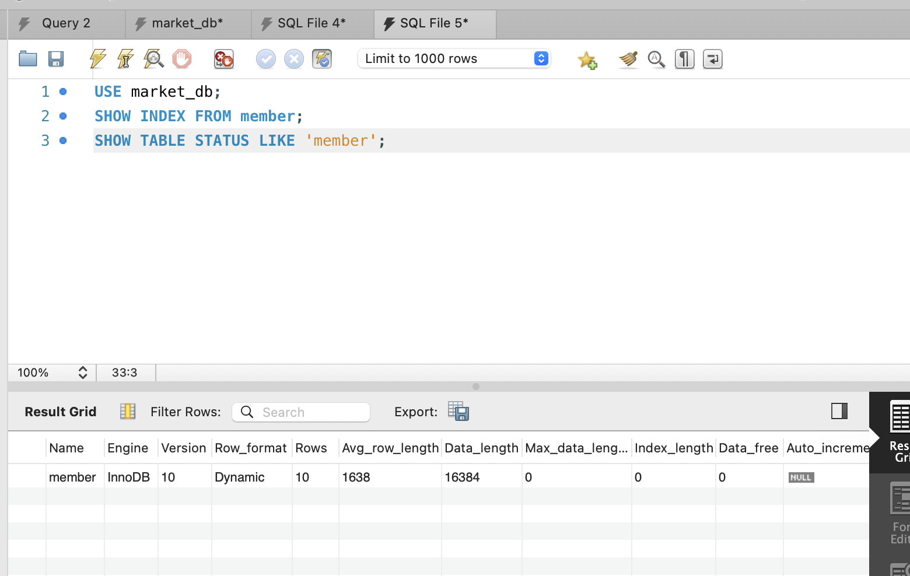
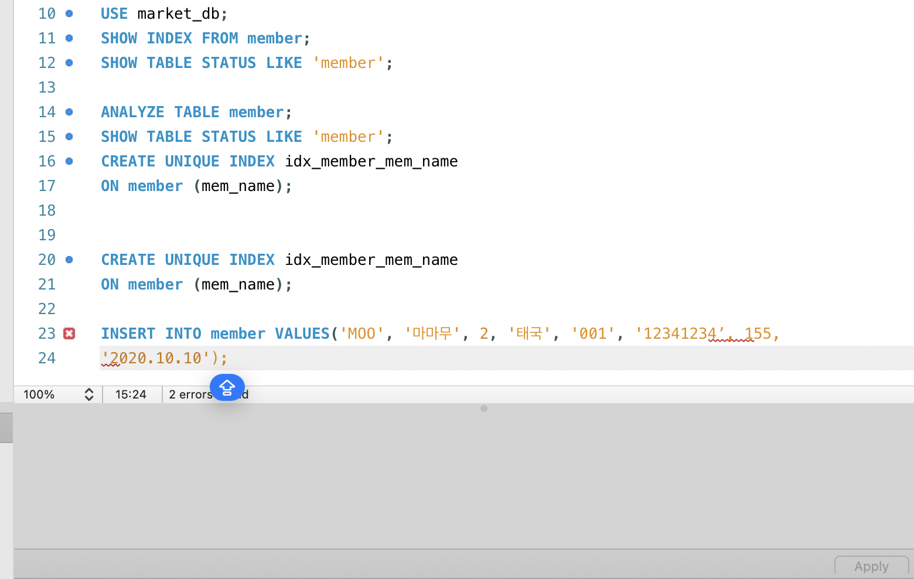
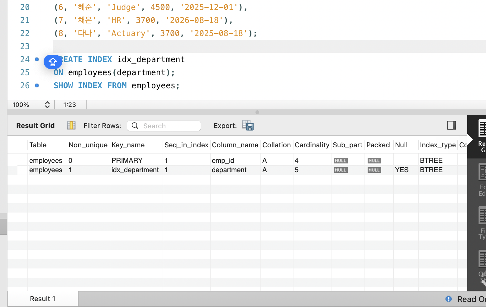
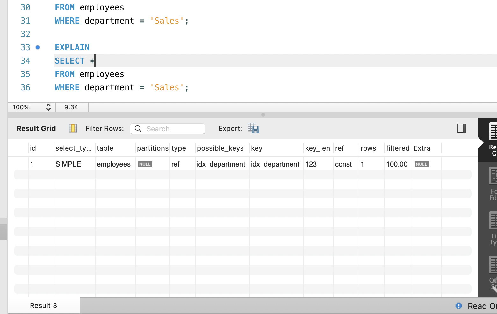

# SQL_ADVANCED 5주차 정규 과제 

📌SQL_ADVANCED 정규과제는 매주 정해진 분량의 『*혼자 공부하는 SQL*』 을 읽고 학습하는 것입니다. 이번주는 아래의 **SQL_ADVANCED_5th_TIL**에 나열된 분량을 읽고 공부하시면 됩니다.

아래의 문제를 풀어보며 학습 내용을 점검하세요. 문제를 해결하는 과정에서 개념을 스스로 정리하고, 필요한 경우 제시된 강의를 참고하여 보완하는 것이 좋습니다.

<!-- 강의 링크는 아래와 같습니다.
https://www.youtube.com/watch?v=KZmW6VaY5BU&list=PLVsNizTWUw7GCfy5RH27cQL5MeKYnl8Pm&index=16
https://www.youtube.com/watch?v=vWTDuoSG-YQ&list=PLVsNizTWUw7GCfy5RH27cQL5MeKYnl8Pm&index=17
https://www.youtube.com/watch?v=aiMSluMNzI8&list=PLVsNizTWUw7GCfy5RH27cQL5MeKYnl8Pm&index=18
-->

**교재 실습 예제 파일은 08_SQL_ADVANCED_Template 레포지토리의 src 폴더에 업로드되어 있습니다. market_db 파일도 해당 폴더에 함께 포함되어 있으니 참고하시기 바랍니다.**

**👀(수행 인증샷은 필수입니다.)** 

## SQL_ADVANCED_5th_TIL

### 6장 인덱스
#### 01. 인덱스 개념을 파악하자
#### 02. 인덱스의 내부 작동
#### 03. 인덱스의 실제 사용  


## Study Schedule

| 주차  | 공부 범위     | 완료 여부 |
| ----- | ------------- | --------- |
| 1주차 | p.24~99    | ✅         |
| 2주차 | p.102~155   | ✅         |
| 3주차 | p.158~213  | ✅         |
| 4주차 | p.216~271 | ✅         |
| 5주차 | p.274~327 | ✅         |
| 6주차 | p.330~369 | 🍽️         |
| 7주차 | p.372~407 | 🍽️         |


<br>

<!-- 여기까진 그대로 둬 주세요-->

---

# 1️⃣ 학습 내용 정리

## 1. 인덱스 개념을 파악하자 

<!-- 인덱스에 관해 배우게 된 점을 적어주세요. -->

- **인덱스(Index)**는 테이블에서 원하는 데이터를 빠르게 찾기 위해 사용하는 자료구조임.
- 책의 맨 뒤에 있는 **색인**과 비슷한 개념으로 이해하면 됨.
- 인덱스가 없으면 원하는 데이터를 찾기 위해 테이블의 데이터를 처음부터 끝까지 확인해야 할 수 있음.
- 인덱스를 사용하면 특정 값을 기준으로 데이터를 더 빠르게 검색할 수 있음.

### 인덱스가 필요한 이유

- 데이터가 적을 때는 큰 차이가 없지만, 데이터의 양이 많아질수록 검색 속도 차이가 커짐.
- 특히 `WHERE`, `JOIN`, `ORDER BY` 등에 자주 사용되는 열에 인덱스를 설정하면 조회 성능을 높일 수 있음.

예시

```sql
SELECT *
FROM member
WHERE mem_id = 'BLK';
- mem_id에 인덱스가 있다면 원하는 데이터를 더 빠르게 찾을 수 있음.

- 인덱스의 장점
- SELECT를 이용한 데이터 검색 속도를 향상시킬 수 있음.
- 많은 데이터 중 특정 데이터를 빠르게 조회할 때 유용함.
- 조인이나 정렬 작업의 성능 향상에도 도움이 될 수 있음.

- 인덱스의 단점
- 인덱스를 저장하기 위한 추가 공간이 필요함.
- INSERT, UPDATE, DELETE가 발생하면 인덱스도 함께 수정해야 하므로 데이터 변경 작업은 오히려 느려질 수 있음.
- 따라서 모든 열에 무조건 인덱스를 만드는 것은 좋지 않음.
인덱스는 조회 속도는 빠르게 만들 수 있지만, 저장 공간과 데이터 수정 비용이 추가되는 구조임.

기본 키와 인덱스
- PRIMARY KEY를 설정하면 일반적으로 해당 열에 인덱스가 자동으로 생성됨.
- UNIQUE 제약조건을 설정한 열에도 인덱스가 생성될 수 있음.
- 따라서 기본 키는 데이터를 고유하게 구분하는 역할뿐만 아니라 빠른 검색에도 활용됨.
예시
CREATE TABLE member (
    mem_id CHAR(8) PRIMARY KEY,
    mem_name VARCHAR(20)
);

- mem_id는 PRIMARY KEY이므로 각 행을 고유하게 구분함.
- 동시에 mem_id를 이용한 검색을 빠르게 처리할 수 있도록 인덱스가 생성됨.
인덱스 생성
CREATE INDEX 인덱스이름
ON 테이블명(열이름);

예시
CREATE INDEX idx_member_name
ON member(mem_name);

- member 테이블의 mem_name 열을 기준으로 idx_member_name이라는 인덱스를 생성함.
인덱스 삭제
DROP INDEX 인덱스이름
ON 테이블명;

예시
DROP INDEX idx_member_name
ON member;

- 생성했던 인덱스를 삭제함.

> ** 확인문제: 다음은 인덱스 종류와 관련된 설명입니다. 가장 거리가 먼 것을 하나 고르세요. **

보기는 아래와 같습니다.
```
1️⃣ 클러스터형 인덱스는 영어사전과 비슷한 개념입니다.
2️⃣ 보조 인덱스는 일반 책의 찾아보기와 비슷한 개념입니다.
3️⃣ 클러스터형 인덱스는 기본 키를 설정하면 자동 생성됩니다.
4️⃣ 보조 인덱스는 NOT NULL을 설정하면 자동 생성됩니다.
```

```
정답: 4번

이유: 보조 인덱스는 NOT NULL을 설정한다고 자동으로 생성되지 않는다. 보조 인덱스는 일반적으로 CREATE INDEX 명령어로 직접 생성하거나, UNIQUE와 같은 제약 조건을 설정할 때 생성될 수 있다. 반면 클러스터형 인덱스는 데이터베이스 시스템에 따라 기본 키를 설정하면 자동으로 생성될 수 있다.
```


## 2. 인덱스의 내부 작동 

<!-- 인덱스의 내부 작동에 관해 배우게 된 점을 적어주세요. -->

## 2. 인덱스의 내부 작동

- MySQL의 인덱스는 일반적으로 **B-Tree 계열 구조**를 사용하여 데이터를 빠르게 찾을 수 있도록 구성됨.
- 인덱스는 값들을 정렬된 형태로 관리하기 때문에 원하는 데이터를 처음부터 끝까지 찾지 않고 빠르게 접근할 수 있음.
- 하지만 데이터가 추가되거나 수정되면 인덱스의 정렬 상태도 함께 유지해야 하므로 추가 작업이 발생함.

### INSERT 시 인덱스가 느려질 수 있는 이유

- 새로운 데이터가 들어오면 인덱스의 적절한 위치에 값을 삽입해야 함.
- 해당 인덱스 페이지에 공간이 충분하면 바로 삽입할 수 있음.
- 하지만 페이지가 이미 가득 차 있다면 새로운 공간을 만들기 위해 **페이지 분할(Page Split)** 작업이 발생할 수 있음.

### 페이지 분할(Page Split)

- 하나의 인덱스 페이지에 더 이상 데이터를 저장할 공간이 없을 때 페이지를 나누는 작업임.
- 기존 데이터를 새로운 페이지로 일부 이동시키고 새로운 데이터를 삽입함.
- 이 과정에서 데이터 이동과 인덱스 구조 조정이 필요하기 때문에 추가적인 시간이 소요됨.
- 페이지 분할이 너무 자주 발생하면 `INSERT` 성능이 떨어질 수 있음.

> 인덱스는 조회 속도를 높여주지만, `INSERT`, `UPDATE`, `DELETE` 시에는 인덱스도 함께 변경해야 하므로 성능 저하가 발생할 수 있음.

---

## 확인문제

> **확인문제: 다음 설명에서 빈칸에 공통으로 들어갈 용어를 쓰시오.**

```
인덱스를 구성하게 되면 데이터의 변경 작업(INSERT, UPDATE, DELETE)시에 성능이 나빠지는 단점이 있습니다.  
특히 INSERT 작업이 일어날 때 더 느리게 입력될 수 있는데요, 이유는 (           ) 이라는 작업이 발생하기 때문입니다.  
(            ) 작업이 일어나면 MySQL이 느려지고 너무 자주 일어나면 성능에 큰 영향을 줍니다.
```

```
페이지 분할
```


## 3. 인덱스의 실제 사용 

<!-- '인덱스 생성과 제거 실습(310p~)' 흐름에 맞게 진행한 후, 실습 과정이 보일 수 있도록 인증 사진을 2장 이상 제출해 주세요. -->




---

# 2️⃣ 실습과제

## 1. 데이터베이스 구축

아래 코드를 MySQL Workbench에 붙여넣은 후,  
**전체 드래그 → 실행 (Ctrl + Shift + Enter)** 하여 데이터베이스를 생성하세요.

```sql
CREATE DATABASE IF NOT EXISTS week5_db;
USE week5_db;

DROP TABLE IF EXISTS employees;

CREATE TABLE employees (
    emp_id INT PRIMARY KEY,
    name VARCHAR(20),
    department VARCHAR(30),
    salary INT,
    hire_date DATE
);

INSERT INTO employees VALUES
(1, '신영', 'Marketing', 3500, '2026-03-01'),
(2, '경모', 'HR', 3200, '2026-06-15'),
(3, '세원', 'IT', 4000, '2024-09-10'),
(4, '진우', 'HR', 5000, '2024-01-20'),
(5, '성환', 'Actuary', 3800, '2025-04-01'),
(6, '혜준', 'Judge', 4500, '2025-12-01'),
(7, '채은', 'HR', 3700, '2026-08-18'),
(8, '다나', 'Actuary', 3700, '2025-08-18');
```

## 2. 실습 문제

다음 문제를 수행하고 실행 결과를 캡처하여 제출하세요.

1. department 컬럼에 보조 인덱스를 생성하시오.
    - 인덱스 생성 후, `SHOW INDEX FROM employees;` 실행 결과가 보이도록 캡처합니다.
    - (idx_department 인덱스가 존재하는지 확인되어야 합니다.)
2. employees 테이블의 인덱스를 확인하시오.
3. department가 'Sales'인 직원을 조회하시오.
   - 'Sales' 조회 시, 반드시 `EXPLAIN`을 함께 실행한 화면을 캡처합니다.
   - (key 컬럼에 idx_department가 표시되어야 합니다.)
4. 생성한 인덱스를 삭제하시오.
   - 인덱스 삭제 후, 다시 `SHOW INDEX FROM employees;`를 실행하여 idx_department가 사라진 것을 확인한 화면을 캡처합니다.

## 3. 제출방법

인덱스 생성 결과, EXPLAIN 실행 결과, 인덱스 삭제 결과가 모두 보이도록 캡처하여 제출하세요.





### 🎉 수고하셨습니다.


